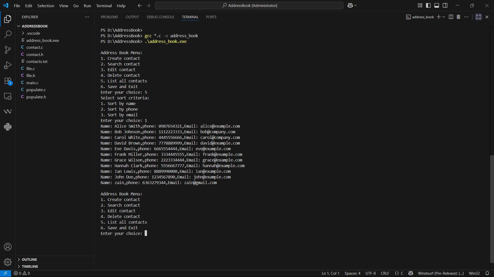

# Address-book
A simple Address Book project built in C to manage contact information.

# Address Book

A simple C project to manage contact information using file handling.

## Features
- Add, delete, modify, and view contacts
- Stores data in a text file
- Command-line interface

## How to Run
gcc main.c address_book.c -o address_book
./address_book

## 📸 Screenshots

### Menu

